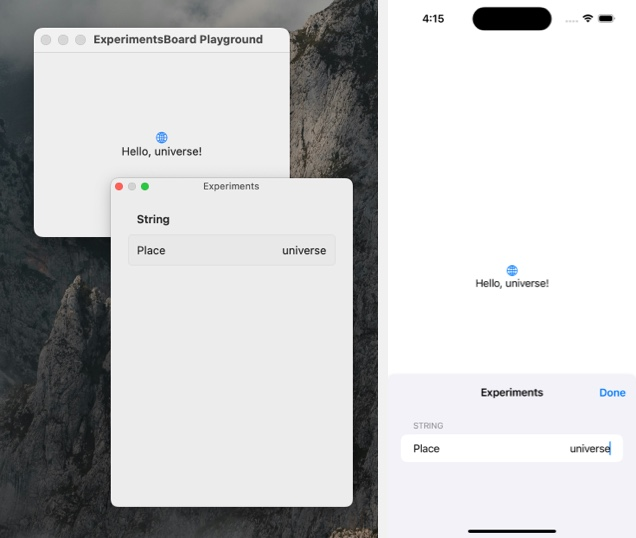

# ExperimentsBoard

_A work of Noetic Garden — by [millenomi](https://millenomi.name)._

The `ExperimentsBoard` module allows you to quickly add UI to turn any constant in your code into something you can tweak and experiment with at runtime.

All it takes is wrapping a constant in a call to `Experiments.value(…)` — for example:

```swift
Text("Hello, world!")

// … turns into:

Text("Hello, \(Experiments.value("world", key: "Place"))!") 
```

Once you do this, just add a couple lines to your app to enable displaying the editing UI, and turn any part of your app into something you can tweak and experiment with without having to roundtrip:



The UI in this module works on iOS 17, macOS 14, tvOS 17, watchOS 10 and visionOS 1 or later, but the core of it is cross-platform — bring your own UI and you can use the same experiment syntax on prior OSes, or on Linux, WebAssembly, or Windows. On those platforms, beside DocC, the only dependency for this module is Swift itself.

The module is fully documented — build the documentation with DocC (in Xcode or by using `swift package generate-documentation`) and check out the Getting Started article to get set up.

## Add To Your Project

To add this package to your project, use the following URL in Xcode, by picking File > Add Package Dependencies…

> https://github.com/noeticgarden/experimentsboard

Or, add it to your package as a dependency as follows:

```swift
…
// Package.swift
let package = Package(
…
    dependencies: [
        …
        .package(url: "https://github.com/noeticgarden/experimentsboard", from: "0.1.0"),
    ],
    …
    targets: [
        .target(…
            dependencies: [
                .product("ExperimentsBoard", package: "experimentsboard")
            ])
    ]
)
```

## License

The contents of this module are licensed under the MIT license except for:

- Sources/ExperimentsBoard/Core/Foundation - LockedState.swift, which is licensed under the Apache License v2.0 with Runtime Library Exception. See <https://swift.org/LICENSE.txt> for more information.

(I would've used Synchronization's `Mutex`, but I love that this module can backdeploy now.)

## Contributions

Use GitHub to [report issues](https://github.com/noeticgarden/experimentsboard/issues) or propose [pull requests](https://github.com/noeticgarden/experimentsboard/pulls).

This package comes with no guarantee that any specific contribution will be included or visibly reviewed, but all issues and pull requests are at least considered. Also, please, be kind; these spaces will be actively moderated at the author's sole discretion.

### 1.0 Acceptance Criteria

These builds are tagged with 0.x (pre-stability) [semantic version numbers](https://semver.org/). The goal for 1.0 is:

 - Consider, or defer, back-porting the editor UI to Apple OS versions prior to Fall 2023.
 - Consider other UI toolkits, especially e.g. Unity.
 - Add a gamut of other useful experiment types besides those for integer, floating-point and string  values;
 - Performance is understood and measured;
 - Provide a compile-time way to disable experiments without removing calls to `Experiments.value(…)` from the source code.

